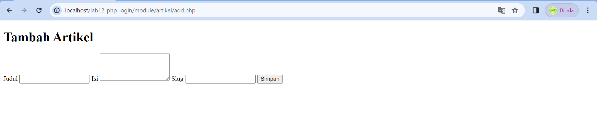

## lOGIN FORM
```
Febriyani Nurhida
312210222
TI.22.A2
```
## Langkah-Langkah

### 1. Buat dulu tabel user
```
CREATE TABLE `user`(
`id` INT NOT NULL AUTO_INCREMENT,
`username` VARCHAR(50),
`password` VARCHAR(50),
PRIMARY KEY (`id`),
UNIQUE INDEX `UNIQUE` (`username`)
) ENGINE=MYISAM;

INSERT INTO `user` (`username`, `password`) VALUES ('admin'
, md5('admin'));
```


di database sekarang sudah ada tabel user untuk admin

### 2. selanjutnya buat file login_session.php
Deskripsi: dignakan untuk pengecekan sesi login, file ini nantinya akan di include di setiap halaman yang membutuhkan login.

```
<?php

session_start();

if (!isset($_SESSION['isLogin']))
    header('location: login.php');

?>
```


### 3. Buat File login.php

```
<?php
session_start();

$title = 'Data Barang';
include_once '../../class/config.php';

if (isset($_POST['submit'])) {
    $user = $_POST['user'];
    $password = $_POST['password'];

    $sql = "SELECT * FROM user WHERE username = '{$user}' AND password = md5('{$password}') ";
    $result = $db->query($sql);
    if ($result && mysqli_affected_rows($conn) != 0) {
        $_SESSION['isLogin'] = true;
        $_SESSION['user'] = mysqli_fetch_array($result);

        header('location: home.php');
    } else {
        $errorMsg = "<p style=\"color:red;\">Gagal Login, silakan ulangi lagi.</p>";
    }
}


if (isset($errorMsg)) echo $errorMsg;
?>

    
    <h2>Login</h2>
    <form method="post">
        <div class="input">
            <label>Username</label>
            <input type="text" name="user" />
        </div>
        <div class="input">
            <label>Password</label>
            <input type="password" name="password" />
        </div>
        <div class="submit">
            <input type="submit" name="submit" value="Login" />
        </div>
    </form>
<?php include_once 'footer.php'; ?>
```


### 4. Jangan lupa untuk membuat method logout seperti berikut :
```
<?php
session_destroy();
header('location: ' . site_url('/'));
?>
```


saya menggunakan project sebelumnya yaitu rpoject CRUD untuk data barang. maka tampilan index akan seperti ini:


terlihat ada menu login di header. saya telah menambahkannya. jika di klik akan seperti ini


sekarang kita bisa melakukan login session:
 note : untuk username : admin
        untuk password : admin


jika sudah berhasil login maka bagian login akan berubah jadi logout. sekarang, tugas kita adalah mengisi artikel dan membuat CRUD untuk artikel.

### 5. Buat dulu tabel daabase untuk artikel

```
    CREATE TABLE artikel (
    id INT(11) auto_increment,
    judul VARCHAR(200) NOT NULL,
    isi TEXT,
    gambar VARCHAR(200),
    status TINYINT(1) DEFAULT 0,
    slug VARCHAR(200),
    PRIMARY KEY(id)
    );
```


di database sekarang sudah ada tabel artikel. selanjutnya:

### 6. Kita isi tabelnya dengan konten :

```
    INSERT INTO artikel (judul, isi, slug) VALUE
    ('Artikel pertama', 'Lorem Ipsum adalah contoh teks atau dummy dalam industri 
    percetakan dan penataan huruf atau typesetting. Lorem Ipsum telah menjadi 
    standar contoh teks sejak tahun 1500an, saat seorang tukang cetak yang tidak 
    dikenal mengambil sebuah kumpulan teks dan mengacaknya untuk menjadi sebuah 
    buku contoh huruf.', 'artikel-pertama'), 
    ('Artikel kedua', 'Tidak seperti anggapan banyak orang, Lorem Ipsum bukanlah 
    teks-teks yang diacak. Ia berakar dari sebuah naskah sastra latin klasik dari 
    era 45 sebelum masehi, hingga bisa dipastikan usianya telah mencapai lebih 
    dari 2000 tahun.', 'artikel-kedua');
    
```

nah jika sudah maka data akan berubah.


### 7. sekarang kita akan mengisi bagian artikel dengan data yang sudah kita tambahkan. caranya :

```
<?php
include_once('template/header.php');
include("koneksi.php");

$sql = 'SELECT * FROM artikel';
$result = mysqli_query($conn, $sql);
?>

<!DOCTYPE html>
<html lang="en">
<head>
    <meta charset="UTF-8">
    <link href="style.css" rel="stylesheet" type="text/css" />
    <style>
        /* Tambahkan gaya CSS sesuai kebutuhan */
    </style>
    <title>Home</title>
</head>
<body>
    <div class="container">
        <h1>Artikel Terbaru</h1>

        <div class="main">
            <?php if ($result): ?>
                <?php while ($row = mysqli_fetch_array($result)): ?>
                    <article class="entry">
                        <h2><a href="detail_artikel.php?id=<?= $row['id']; ?>"><?= $row['judul']; ?></a></h2>
                        <p><?= substr($row['isi'], 0, 200); ?></p>
                    </article>
                    <hr class="divider" />
                <?php endwhile; ?>
            <?php else: ?>
                <p>Belum ada artikel.</p>
            <?php endif; ?>
        </div>
    </div>
</body>
</html>

<?php include_once('template/footer.php'); ?>
```


maka outputnya akan seperti ini :


### 8. Buat file admin.php di class artikel.

```
<?php
include_once('template/header.php');
include("koneksi.php");

$sql = 'SELECT * FROM artikel';
$result = mysqli_query($conn, $sql);
?>

<!DOCTYPE html>
<html lang="en">
<head>
    <meta charset="UTF-8">
    <link href="style.css" rel="stylesheet" type="text/css" />
    <style>
        th {
            background-color: pink;
            color: white;
            padding: 10px;
            text-align: left;
            font-size: 16px;
            font-weight: normal;
        }

        .tambah-button {
            background-color: pink;
            border: none;
            color: white;
            padding: 10px 10px;
            text-align: center;
            text-decoration: none;
            display: inline-block;
            font-size: 16px;
            margin: 8px 6px;
            cursor: pointer;
            font-weight: normal;
        }
    </style>
    <title>Data Artikel</title>
</head>
<body>
    <div class="container">
        <h1>Data Artikel</h1>
        <a href="/lab12_php_login/module/artikel/add.php" class="tambah-button">Tambah Artikel</a>

        <div class="main">
            <table border="1" cellpadding="5" cellspacing="0">
                <tr>
                    <th>Judul</th>
                    <th>Isi</th>
                    <th>Slug</th>
                    <th>Aksi</th>
                </tr>
                <?php if ($result): ?>
                    <?php while ($row = mysqli_fetch_array($result)): ?>
                        <tr>
                            <td><?= $row['judul']; ?></td>
                            <td><?= substr($row['isi'], 0, 200); ?></td>
                            <td><?= $row['slug']; ?></td>
                            <td>
                                <a href="/lab12_php_login/module/artikel/ubah.php?id=<?= $row['id']; ?>">Ubah</a>
                                <a href="/lab12_php_login/module/artikel/hapus.php?id=<?= $row['id']; ?>">Hapus</a>
                            </td>
                        </tr>
                    <?php endwhile; ?>
                <?php else: ?>
                    <tr>
                        <td colspan="4">Belum ada data</td>
                    </tr>
                <?php endif; ?>
            </table>
        </div>
    </div>
</body>
</html>

<?php include_once('template/footer.php'); ?>
```


maka tampilannya akan seperti ini :


### 9. Sekarang kita buat file add.php untuk menambahkan artikel.

```
<?php
include("koneksi.php");

$successMessage = '';

if ($_SERVER['REQUEST_METHOD'] === 'POST') {
    // Proses form tambah data artikel
    $judul = $_POST['judul'];
    $isi = $_POST['isi'];
    $slug = $_POST['slug'];

    // Lakukan validasi dan simpan data ke database
    $sql = "INSERT INTO artikel (judul, isi, slug) VALUES ('$judul', '$isi', '$slug')";

    if (mysqli_query($conn, $sql)) {
        $successMessage = 'Data berhasil ditambahkan.';
    } else {
        $errorMessage = 'Error: ' . mysqli_error($conn);
    }
}
?>

<!DOCTYPE html>
<html lang="en">
<head>
    <meta charset="UTF-8">
    <link href="style.css" rel="stylesheet" type="text/css" />
    <title>Tambah Artikel</title>
</head>
<body>
    <div class="container">
        <h1>Tambah Artikel</h1>

        <?php if (!empty($successMessage)): ?>
            <p style="color: green;"><?php echo $successMessage; ?></p>
        <?php endif; ?>

        <?php if (!empty($errorMessage)): ?>
            <p style="color: red;"><?php echo $errorMessage; ?></p>
        <?php endif; ?>

        <form method="post" action="">
            <label>Judul</label>
            <input type="text" name="judul" required>

            <label>Isi</label>
            <textarea name="isi" rows="4" required></textarea>

            <label>Slug</label>
            <input type="text" name="slug" required>

            <button type="submit">Simpan</button>
        </form>
    </div>
</body>
</html>
```


outputnya akan seperti ini saat kita klik button tambah artikel



misal kita tambahkan data baru seperti berikut:


setelah di klik simpan maka data baru akan muncul seperti berikut :


### 10. Buat file ubah.php untuk mengubah data.

```
<?php
include("koneksi.php");

$id = $_GET['id'];
$successMessage = $errorMessage = '';

if ($_SERVER['REQUEST_METHOD'] === 'POST') {
    // Proses form ubah data artikel
    $judul = $_POST['judul'];
    $isi = $_POST['isi'];
    $slug = $_POST['slug'];

    // Lakukan validasi dan perbarui data di database
    $sqlUpdate = "UPDATE artikel SET judul='$judul', isi='$isi', slug='$slug' WHERE id=$id";

    if (mysqli_query($conn, $sqlUpdate)) {
        $successMessage = 'Data berhasil diubah.';
    } else {
        $errorMessage = 'Error updating data: ' . mysqli_error($conn);
    }
}

$sql = "SELECT * FROM artikel WHERE id = $id";
$result = mysqli_query($conn, $sql);
$row = mysqli_fetch_array($result);
?>

<!DOCTYPE html>
<html lang="en">
<head>
    <meta charset="UTF-8">
    <link href="style.css" rel="stylesheet" type="text/css" />
    <title>Ubah Artikel</title>
</head>
<body>
    <div class="container">
        <h1>Ubah Artikel</h1>

        <?php
        if (!empty($successMessage)) {
            echo '<p style="color: green;">' . $successMessage . '</p>';
        }
        
        if (!empty($errorMessage)) {
            echo '<p style="color: red;">' . $errorMessage . '</p>';
        }
        ?>

        <form method="post" action="">
            <label>Judul</label>
            <input type="text" name="judul" value="<?= $row['judul']; ?>" required>

            <label>Isi</label>
            <textarea name="isi" rows="4" required><?= $row['isi']; ?></textarea>

            <label>Slug</label>
            <input type="text" name="slug" value="<?= $row['slug']; ?>" required>

            <button type="submit">Simpan</button>
        </form>
    </div>
</body>
</html>

```
outpunya akan seperti ini :


misal, kita ingin mengubah judul artikel menjadi arikel ke tiga:


setelah di klik simpan maka akan :


data pun berhasil diubah.


### 10. setelah itu kita buat file hapus.php untuk menghapus data

```
<?php
include("koneksi.php");

$id = $_GET['id'];

// Hapus data dari database
$sql = "DELETE FROM artikel WHERE id = $id";

if (mysqli_query($conn, $sql)) {
    $message = "Artikel telah dihapus.";
} else {
    $message = "Error: " . $sql . "<br>" . mysqli_error($conn);
}
?>

<!DOCTYPE html>
<html lang="en">
<head>
    <meta charset="UTF-8">
    <link href="style.css" rel="stylesheet" type="text/css" />
    <title>Hapus Artikel</title>
</head>
<body>
    <div class="container">
        <h1>Hapus Artikel</h1>
        <p><?= $message; ?></p>
    </div>
</body>
</html>

```

misal kita ingin menghapus artikel ke tiga, saat di klik akan seperti ini:


dan data pun berhasil dihapus.


### 11. Saya membuat file about.php agar tidak kosong mhehe.

```
<?php include_once('template/header.php'); ?>

<!DOCTYPE html>
<html lang="en">
<head>
    <meta charset="UTF-8">
    <link href="style.css" rel="stylesheet" type="text/css" />
    <title>About Project</title>
</head>
<body>
    <div class="container">
        <h1>About This Project</h1>

        <p>Welcome to our project!</p>

        <h2>Overview</h2>
        <p>
            This project is a web application built with PHP that allows users to manage articles.
            Users can view a list of articles, read their details, add new articles, edit existing articles, and delete articles.
        </p>

        <h2>Features</h2>
        <ul>
            <li>View a list of articles with their titles, summaries, and images.</li>
            <li>Click on an article to read its full content.</li>
            <li>Add new articles with a title, content, and image.</li>
            <li>Edit existing articles to update their title, content, and image.</li>
            <li>Delete articles to remove them from the system.</li>
        </ul>

        <h2>Technologies Used</h2>
        <ul>
            <li>PHP for server-side scripting.</li>
            <li>MySQL for the database to store article information.</li>
            <li>HTML, CSS, and JavaScript for the frontend interface.</li>
        </ul>

        <h2>How to Use</h2>
        <p>
            To get started, navigate through the available pages using the top navigation menu.
            You can view articles, add new articles, and manage existing articles through the provided functionality.
        </p>

        <h2>Contributors</h2>
        <p>
            This project was created by Febriyani Nurhida and tech by Bapak Agung Nugroho S.kom., M.Kom.
            We hope you find it useful for managing and presenting articles on your website!
        </p>
    </div>
</body>
</html>

<?php include_once('template/footer.php'); ?>

```

outputnya akan seperti ini :


### terakhir kita akan melakukan sesi logout. karena diatas kitas sudah buat file logout bersamaan dengan file login. maka sekarang tinggal klik saya header logoutnya.


maka tampilan akan kembali ke index. dan header logout berubah jadi login. dan bagian tambah artikel dan about saat kita ingin melihatnya kita harus melakukan login terlebih dahulu.


### Sekian dari saya, semoga tutorial ini bermanfaat terutama untuk teman-teman yang mau menjadikan ini sebagai referensi :) selamat mencoba and WISH ME LUCK for UAS :)
